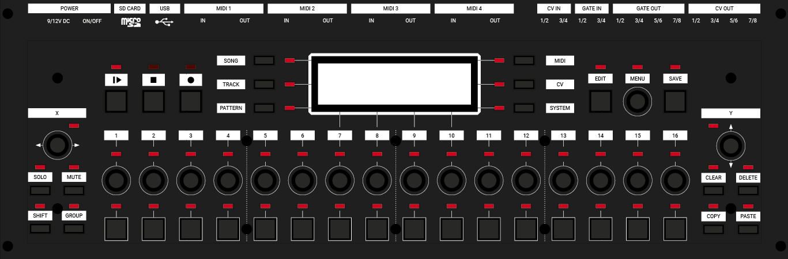
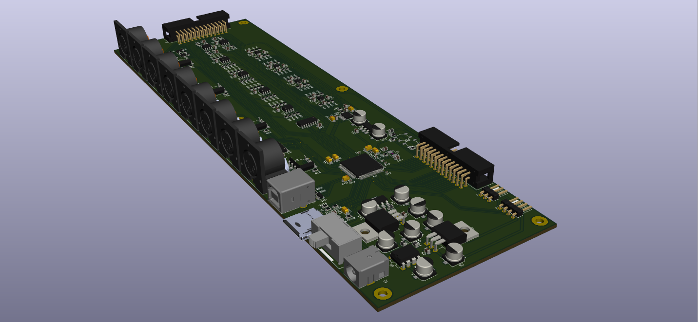

# MIDI & CV Sequencer
</a>

## Features
- 16 Midi tracks
- 4 track types
	* Note track
	* Chord track
	* Curve track
	* Drum track
- 255 patterns total
- 8 CV & gate outputs
- 4 CV & gate inputs
- 4 Midi in & out ports
- Midi Usb port
- microSD card storage
- Monochrome OLED screen
- 19 clickable encoders
- 54 Duo color LED’s
- 35 buttons

## Specs
- Cortex-M4 ARM 168mHz (STM32F4)
- 16 bit DAC
- +/-5V CV in & out
- 7V gate out
- 9/12V DC power

## Code structure
- `/Drivers`			Hardware peripheral drivers
- `/LookUpTables`	Tables & table generation
- `/Stm32`				MCU config & helpers
- `/Src/Settings`	All the sequencer data
- `/Src/Ui`				User interface to manipulate & visualize the data
- `/Src/Engine`		Responsible for running the data & talk to the hardware drivers
- `/Src/Disk`			Filesystem

## Credits
- Westlicht			https://github.com/westlicht
- Pichenettes		https://github.com/pichenettes
- Chan					https://elm-chan.org/fsw/ff/00index_e.html
- Ha Thach 			https://docs.tinyusb.org/en/latest/

## License

</a>
